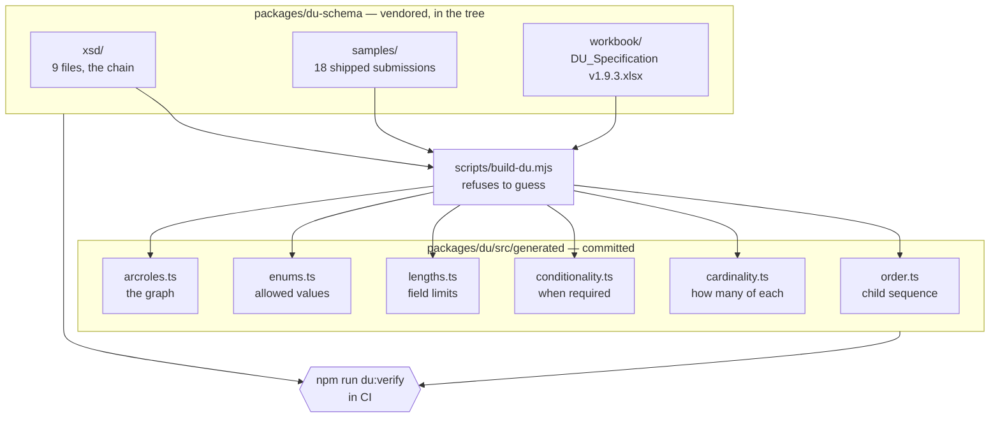

# Where the DU tables come from

Six TypeScript files under `packages/du/src/generated` describe what Desktop
Underwriter will accept. None of them is written by hand. They are derived from
Fannie Mae's own specification by `scripts/build-du.mjs`, committed, and checked
on every CI run.

This page is the orientation. `packages/du-schema/README.md` is the provenance
record — which file came from where, and what it is worth.

## The pipeline



Roughly 2,800 lines of generator produce roughly 10,800 lines of table. The
ratio is the point: almost nothing in the output is a judgment, and the
judgments that do exist are in one file where they can be argued with.

## Two rules that are not style preferences

**The generator refuses to guess.** Every mapping in `build-du.mjs` is
exhaustive and throws on a value it does not recognize. A specification change
that adds a screen, a source, a condition phrase or an arcrole **stops the
build** rather than silently defaulting — which is the same discipline
`scripts/build-requirements.mjs` follows for `data/v1-build.csv`, and for the
same reason: a table of plausible-looking wrong values is worse than a failure.

**Never hand-edit a generated file.** `npm run du:verify` regenerates in memory
and fails on any drift. The committed copies exist so that TypeScript can
resolve a type without a build step running first — a build step that has to run
before an editor works is a build step that breaks somebody's editor — not
because they are a place to make a change.

To change what the tables say, change the specification the build reads, or
change the generator. Then:

```bash
npm run du:build     # rewrite the six tables
npm run du:verify    # what CI runs; fails on drift
```

## What the six tables hold

| File                | What it is                                                         | Derived from                                                                                                                                                                                           |
| ------------------- | ------------------------------------------------------------------ | ------------------------------------------------------------------------------------------------------------------------------------------------------------------------------------------------------ |
| `order.ts`          | The child sequence of every container, and the type at every XPath | The XSD chain — read from the schema rather than sorted, because `xsd:sequence` order is not alphabetical and a serializer that sorts produces a document that fails validation                        |
| `cardinality.ts`    | How many of each container may appear                              | The workbook's Cardinality tab                                                                                                                                                                         |
| `conditionality.ts` | When a field is required, and under what condition                 | The workbook, keyed by Fannie's condition statements verbatim                                                                                                                                          |
| `lengths.ts`        | Field length limits                                                | The workbook                                                                                                                                                                                           |
| `enums.ts`          | The DU-supported members of every `Du*` enum                       | The workbook's DU Enumerations tab, **not** the wider MISMO XSD — the XSD's enumerations are a superset, and emitting a value MISMO allows but DU does not is a submission that fails at the other end |
| `arcroles.ts`       | The relationship graph — see `docs/du-graph.md`                    | The workbook's ArcRoles tab, with each arc's exercised flag re-counted from the eighteen vendored samples                                                                                              |

## What CI actually checks

`npm run check` runs `du:verify`, which is the only thing standing between a
hand-edit and a submission built on it. On a clean checkout, with no environment
variable set and nothing fetched:

```
✓ 16 Du* enum(s) in schema.prisma match the DU Spec
✓ 227 child sequences in order.ts match the vendored MISMO chain
✓ 9 of 11 arcroles in arcroles.ts are exercised by the vendored samples, and no sample carries another
✓ 3 per-kind asset CHECK(s) admit exactly their section's 22 AssetType values
✓ du_owned_properties.asset_kind and du_owned_properties_attach_to_an_reo_asset still hold the REO nesting
✓ 6 generated files match the DU Spec 1.9.3
```

**No table is skipped.** One check in that list can be: the REO nesting is the
only one that asks a database rather than reading a file, so it skips where
there is no database to ask, and says so. A test holds that distinction rather
than forbidding the word "skipped" outright — the difference between a check
that could not run and a table that quietly stopped being checked is the whole
value of the line.

Two of the checks above are worth calling out because they check something other
than themselves.

**The enum check reaches into `schema.prisma`.** Sixteen `Du*` enums are
hand-typed in the Prisma schema, and `du:verify` fails the build if any member
has no row behind it in the specification. That is the check that catches a
fabricated value sitting in a block whose comment claims it was generated.

**The arcrole check reaches into the samples.** It re-counts which arcs the
eighteen shipped submissions carry, so the `exercised` flag cannot go stale, and
it fails if a sample carries an arcrole the table does not define.

Alongside it, `packages/du-schema` validates all eighteen samples against the
full nine-file chain by shelling out to `xmllint` — no XML library was added to
the dependency tree for it, and the helper **throws** when `xmllint` is missing
rather than reporting success, because a green tick for a check that did not run
is worse than no check at all.

**Read `docs/du-graph.md` for what that validation does not buy you.** It is
less than it looks, and the gap is the reason this product's invariants live in
the database.

## The inputs are vendored

Everything the build reads is in the tree: the chain, the eighteen samples and
the workbook. There is no environment variable to set and no folder to be
handed, which is what makes every check above run on any checkout rather than
only on a machine that happens to have the corpus. `DU_SPEC_DIR` is gone rather
than demoted to an override — the workbook's path is a constant derived from the
spec version, and a test asserts the variable's name appears nowhere in the
verify output.

The chain is nine XSDs, resolved by walking `schemaLocation` outward from
`DU_Wrapper_3.4.0_B324.xsd` — not by collecting every file with that extension,
because the corpus holds seventeen and eight of them belong to other packagings
or to the data dictionary. `packages/du-schema/README.md` names each file, where
it came from, and why it is in the chain, and a test re-walks that closure and
fails if the directory and the imports disagree.

These are Fannie Mae's and MISMO's files, carried here under a decision recorded
in `docs/du-readiness.md`: build as though the licenses and agreements are in
place, on the understanding that no real borrower and no real mortgage goes
through this system until they are.
