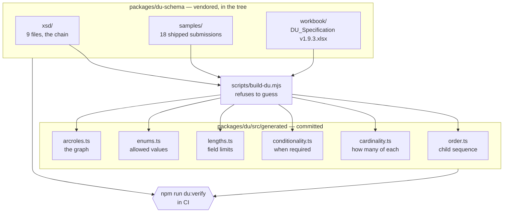

# Where the DU tables come from

Six TypeScript files under `packages/du/src/generated` describe what Desktop
Underwriter will accept. None of them is written by hand. They are derived from
Fannie Mae's own specification by `scripts/build-du.mjs`, committed, and checked
on every CI run.

This page is the orientation. `packages/du-schema/README.md` is the provenance
record — which file came from where, and what it is worth.

## The pipeline



Roughly 2,800 lines of generator produce roughly 10,800 lines of table. The
ratio is the point: almost nothing in the output is a judgment, and the
judgments that do exist are in one file where they can be argued with.

## Two rules that are not style preferences

**The generator refuses to guess.** Every mapping in `build-du.mjs` is
exhaustive and throws on a value it does not recognize. A specification change
that adds a screen, a source, a condition phrase or an arcrole **stops the
build** rather than silently defaulting — which is the same discipline
`scripts/build-requirements.mjs` follows for `data/v1-build.csv`, and for the
same reason: a table of plausible-looking wrong values is worse than a failure.

**Never hand-edit a generated file.** `npm run du:verify` regenerates in memory
and fails on any drift. The committed copies exist so that TypeScript can
resolve a type without a build step running first — a build step that has to run
before an editor works is a build step that breaks somebody's editor — not
because they are a place to make a change.

To change what the tables say, change the specification the build reads, or
change the generator. Then:

```bash
npm run du:build     # rewrite the six tables
npm run du:verify    # what CI runs; fails on drift
```

## What the six tables hold

| File                | What it is                                                         | Derived from                                                                                                                                                                                           |
| ------------------- | ------------------------------------------------------------------ | ------------------------------------------------------------------------------------------------------------------------------------------------------------------------------------------------------ |
| `order.ts`          | The child sequence of every container, and the type at every XPath | The XSD chain — read from the schema rather than sorted, because `xsd:sequence` order is not alphabetical and a serializer that sorts produces a document that fails validation                        |
| `cardinality.ts`    | How many of each container may appear                              | The workbook's Cardinality tab                                                                                                                                                                         |
| `conditionality.ts` | When a field is required, and under what condition                 | The workbook, keyed by Fannie's condition statements verbatim                                                                                                                                          |
| `lengths.ts`        | Field length limits                                                | The workbook                                                                                                                                                                                           |
| `enums.ts`          | The DU-supported members of every `Du*` enum                       | The workbook's DU Enumerations tab, **not** the wider MISMO XSD — the XSD's enumerations are a superset, and emitting a value MISMO allows but DU does not is a submission that fails at the other end |
| `arcroles.ts`       | The relationship graph — see `docs/du-graph.md`                    | The workbook's ArcRoles tab, with each arc's exercised flag re-counted from the eighteen vendored samples                                                                                              |

## What CI actually checks

`npm run check` runs `du:verify`, which is the only thing standing between a
hand-edit and a submission built on it. On a clean checkout, with no environment
variable set and nothing fetched:

```
✓ 16 Du* enum(s) in schema.prisma match the DU Spec
✓ 227 child sequences in order.ts match the vendored MISMO chain
✓ 9 of 11 arcroles in arcroles.ts are exercised by the vendored samples, and no sample carries another
✓ 271 of 468 element paths in the vendored samples are not modeled, and du-not-round-tripped.txt lists them under 34 named containers
✓ 35 modeled blocks name the table or the constant that holds them
✓ 3 per-kind asset CHECK(s) admit exactly their section's 22 AssetType values
✓ du_owned_properties.asset_kind and du_owned_properties_attach_to_an_reo_asset still hold the REO nesting
✓ 6 generated files match the DU Spec 1.9.3
```

**No table is skipped.** One check in that list can be: the REO nesting is the
only one that asks a database rather than reading a file, so it skips where
there is no database to ask, and says so. A test holds that distinction rather
than forbidding the word "skipped" outright — the difference between a check
that could not run and a table that quietly stopped being checked is the whole
value of the line.

Two of the checks above are worth calling out because they check something other
than themselves.

**The enum check reaches into `schema.prisma`.** Sixteen `Du*` enums are
hand-typed in the Prisma schema, and `du:verify` fails the build if any member
has no row behind it in the specification. That is the check that catches a
fabricated value sitting in a block whose comment claims it was generated.

**The arcrole check reaches into the samples.** It re-counts which arcs the
eighteen shipped submissions carry, so the `exercised` flag cannot go stale, and
it fails if a sample carries an arcrole the table does not define.

Alongside it, `packages/du-schema` validates all eighteen samples against the
full nine-file chain by shelling out to `xmllint` — no XML library was added to
the dependency tree for it, and the helper **throws** when `xmllint` is missing
rather than reporting success, because a green tick for a check that did not run
is worse than no check at all.

**Read `docs/du-graph.md` for what that validation does not buy you.** It is
less than it looks, and the gap is the reason this product's invariants live in
the database.

## What a submission carries and this model does not

The six tables above say what DU will accept. They say nothing about how much of
it we can produce, and that question has one answer in the tree:
`packages/du-schema/du-not-round-tripped.txt`.

It is the eighteen vendored samples' element paths **minus the set this model
claims**, which is `MODELED_CHILDREN` in `scripts/build-du.mjs`. Its own header
carries the three counts, because they are derived and this page is not. The
file is regenerated by `npm run du:build` alongside the six tables and diffed by
`npm run du:verify` like them, so a container that becomes modeled leaves the
file in the same change that models it, and one a future sample introduces
arrives in it.

**This used to be written by hand, and a written inventory was wrong in both
directions at once.** It named seven containers as deliberately excluded while
eight more that appear in every sample went unmentioned, and two of its seven —
`RELATED_LOAN` and `ALIAS` — occur **zero** times in the corpus as element
names. The construct the first of them meant is `LOAN[@LoanRoleType="RelatedLoan"]`,
nine instances across eight files. A list nobody ran cannot keep a round trip
honest, and the round trip is the only end-to-end check there will be: it runs
over the modeled set, against this inventory, and an element in neither fails
it. That last clause is what stops the inventory from becoming an excuse list,
and it is only enforceable because the inventory is now measured.

**Two things are measured now, not one.** A path in `MODELED_CHILDREN` has to
occur in the corpus, which is what stops a claim about a shape nobody ships;
and it has to name what holds it — a table `schema.prisma` maps, or the literal
`constant` for bytes we assert about ourselves. The second half is newer than
the first, and it is the half that found vesting, an originator's license and a
counseling agency's role identifier all being declared as modeled by a database
holding none of them. Those three are bullets below now rather than silent
absences.

**A path is a path, not an instance.** `PARTY/ADDRESSES/ADDRESS`,
`PARTY/INDIVIDUAL/NAME` and `TAXPAYER_IDENTIFIERS` are claimed from both sides
at once: the borrower's are facts on the party, the origination company's are
constants about us, and the corpus hangs both under the same path. What that
buys is a subtraction that answers "can we emit this element at all", not "can
we emit every instance of it the samples carry", and the difference is the
property owner — whose name we would write and whose vesting we would not.

Attributes are outside the subtraction, with one exception. A `LOAN` carries its
`LoanRoleType` in its path, because that attribute is the whole of what
separates the loan being applied for from one the borrower already owes; without
it nine related loans across eight files land on the subject loan's path and
read as modeled. The `xlink` labels that carry the graph are counted nowhere
here — `docs/du-graph.md` and `generated/arcroles.ts` are where the arcs are.

The file carries every unmodeled path, including data points sitting loose
inside containers we do model — `SUBJECT_PROPERTY/PROPERTY_DETAIL` holds fifteen
of those. What follows names the **containers** this model stops at, one bullet
each, and `du:verify` fails when the two disagree in either direction: an
unexplained container, or an explanation for a container that is now modeled.

- `MESSAGE/DOCUMENT_SETS` — the signature block. We hold an execution date; what
  goes in here is the e-signed URLA itself, which is a document story and not a
  model gap.
- `DEAL/COLLATERALS/COLLATERAL/SUBJECT_PROPERTY/LOCATION_IDENTIFIER` — census
  tract, FIPS and MSA. Nothing collects them, and no borrower ever will.
- `DEAL/COLLATERALS/COLLATERAL/SUBJECT_PROPERTY/MANUFACTURED_HOME` — one sample,
  and three element paths inside it, one of which is a width. A manufactured
  home is a product decision before it is a column.
- `DEAL/COLLATERALS/COLLATERAL/SUBJECT_PROPERTY/PROJECT` — condominium and PUD
  project detail. A small table when somebody wants it.
- `DEAL/COLLATERALS/COLLATERAL/SUBJECT_PROPERTY/PROPERTY_VALUATIONS` — the
  appraisal. `connector_snapshots` holds valuation pulls and nothing maps one
  onto this container yet.
- `DEAL/COLLATERALS/COLLATERAL/SUBJECT_PROPERTY/SALES_CONTRACTS` — the purchase
  contract and its concessions.
- `DEAL/LIABILITIES/LIABILITY_SUMMARY` — two totals we would assert and DU would
  re-derive. Every number on a decision comes from a recorded derivation here,
  so these belong in `DerivationLog` before they belong in a submission.
- `DEAL/LOANS/LOAN[@LoanRoleType="RelatedLoan"]` — a loan that is not the one
  being applied for: a simultaneous second lien, a community second, the HELOC
  behind a piggyback. Nine across eight files, every one of them
  `LienPriorityType` `SecondLien`, carrying its own P&I payment, its own note
  amount and — in `DI-C05` — a `HELOC` container of its own. `du_liabilities`
  holds a borrower's existing mortgages; nothing holds a second loan closing
  alongside this one, and the funding sources inside it (state agency, local
  agency, community non-profit, religious non-profit, lender) are the same
  subject this loan's `AFFORDABLE_LENDING` is.
- `DEAL/LOANS/LOAN[@LoanRoleType="SubjectLoan"]/ADJUSTMENT` — the ARM margin and
  its adjustment rules.
- `DEAL/LOANS/LOAN[@LoanRoleType="SubjectLoan"]/AFFORDABLE_LENDING` — community
  lending and community seconds.
- `DEAL/LOANS/LOAN[@LoanRoleType="SubjectLoan"]/CLOSING_INFORMATION` — closing
  adjustments and cash at closing.
- `DEAL/LOANS/LOAN[@LoanRoleType="SubjectLoan"]/CONSTRUCTION` —
  construction-to-permanent.
- `DEAL/LOANS/LOAN[@LoanRoleType="SubjectLoan"]/DOCUMENT_SPECIFIC_DATA_SETS` —
  the URLA totals block: estimated closing costs, prepaid items, the financed
  mortgage-insurance figures. Every sample carries it, and it is arithmetic over
  figures no screen asks for.
- `DEAL/LOANS/LOAN[@LoanRoleType="SubjectLoan"]/GOVERNMENT_LOAN` — FHA and VA
  identifiers and entitlement. We underwrite neither.
- `DEAL/LOANS/LOAN[@LoanRoleType="SubjectLoan"]/HMDA_LOAN` — HOEPA status and
  rate spread.
- `DEAL/LOANS/LOAN[@LoanRoleType="SubjectLoan"]/HOUSING_EXPENSES` — present and
  proposed housing expense. The largest single absence in this list, and it is a
  table rather than a column: the container repeats per expense type and per
  timing.
- `DEAL/LOANS/LOAN[@LoanRoleType="SubjectLoan"]/INVESTOR_LOAN_INFORMATION` — the
  investor product plan.
- `DEAL/LOANS/LOAN[@LoanRoleType="SubjectLoan"]/LOAN_DETAIL/EXTENSION` — DU's
  energy-improvement amount.
- `DEAL/LOANS/LOAN[@LoanRoleType="SubjectLoan"]/ORIGINATION_SYSTEMS` — the name,
  vendor and version of the system that produced the file. Ours to assert about
  ourselves, on every sample, and nothing here asserts it.
- `DEAL/LOANS/LOAN[@LoanRoleType="SubjectLoan"]/PURCHASE_CREDITS` — seller and
  lender credits.
- `DEAL/LOANS/LOAN[@LoanRoleType="SubjectLoan"]/QUALIFICATION` — the qualifying
  rate, and a rental-history indicator in the ULAD extension.
- `DEAL/LOANS/LOAN[@LoanRoleType="SubjectLoan"]/REFINANCE` — refinance purpose
  and cash-out determination. `loan_files.purpose` splits a rate-and-term
  refinance from a cash-out one and `cash_out_purpose` says what the cash is
  for, so this container is nearer than most of the list; what is missing is the
  mapping, not the answer.
- `DEAL/PARTIES/PARTY/LANGUAGES` — the borrower's preferred language. We collect
  one, on the fact that puts a file into limited-English handling, and this is
  the container it would be written to.
- `DEAL/PARTIES/PARTY/ROLES/ROLE/BORROWER/COUNSELING` — housing counseling
  events. We provide none, and the arc to the counselor is deferred with the
  container.
- `DEAL/PARTIES/PARTY/ROLES/ROLE/BORROWER/DEPENDENTS` — each dependent's age.
  The cardinality note claims a VA minimum of one, and `DI-VA01` ships no
  `DEPENDENT` at all, which is what contradicts a minimum; the other three VA
  samples carry four dependents between them.
- `DEAL/PARTIES/PARTY/ROLES/ROLE/BORROWER/EMPLOYERS/EMPLOYER/ADDRESS` — the
  employer's address. `employers` carries a name and an EIN and no address.
- `DEAL/PARTIES/PARTY/ROLES/ROLE/BORROWER/EMPLOYERS/EMPLOYER/EMPLOYMENT/EXTENSION`
  — DU's foreign-income and seasonal-income indicators.
- `DEAL/PARTIES/PARTY/ROLES/ROLE/BORROWER/EMPLOYERS/EMPLOYER/LEGAL_ENTITY/CONTACTS`
  — a telephone number for the employer.
- `DEAL/PARTIES/PARTY/ROLES/ROLE/BORROWER/GOVERNMENT_BORROWER` — the VA federal
  tax amount.
- `DEAL/PARTIES/PARTY/ROLES/ROLE/BORROWER/GOVERNMENT_MONITORING` — demographics.
  `borrowers.demographics` is untyped JSON and this is a three-namespace jigsaw:
  race repeats five times with ten designations nested inside, and ethnicity
  lives in a ULAD extension of a different container.
- `DEAL/PARTIES/PARTY/ROLES/ROLE/BORROWER/MILITARY_SERVICES` — military status
  and expected completion date.

## The inputs are vendored

Everything the build reads is in the tree: the chain, the eighteen samples and
the workbook. There is no environment variable to set and no folder to be
handed, which is what makes every check above run on any checkout rather than
only on a machine that happens to have the corpus. `DU_SPEC_DIR` is gone rather
than demoted to an override — the workbook's path is a constant derived from the
spec version, and a test asserts the variable's name appears nowhere in the
verify output.

The chain is nine XSDs, resolved by walking `schemaLocation` outward from
`DU_Wrapper_3.4.0_B324.xsd` — not by collecting every file with that extension,
because the corpus holds seventeen and eight of them belong to other packagings
or to the data dictionary. `packages/du-schema/README.md` names each file, where
it came from, and why it is in the chain, and a test re-walks that closure and
fails if the directory and the imports disagree.

These are Fannie Mae's and MISMO's files, carried here under a decision recorded
in `docs/du-readiness.md`: build as though the licenses and agreements are in
place, on the understanding that no real borrower and no real mortgage goes
through this system until they are.
