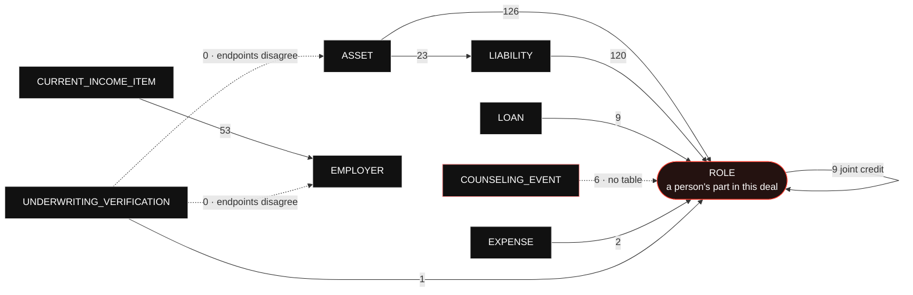

# A DU submission is a graph

What Desktop Underwriter receives is not a nested document with an
`ASSET` inside a `BORROWER`. It is a flat set of containers, each carrying an
`xlink:label`, plus a `RELATIONSHIPS` block whose `RELATIONSHIP` elements arc
between those labels by arcrole URI.

```xml
<ASSET xlink:label="ASSET_1"> … </ASSET>
<ROLE  xlink:label="PARTY_1_ROLE"> … </ROLE>
…
<RELATIONSHIP
  xlink:from="ASSET_1"
  xlink:to="PARTY_1_ROLE"
  xlink:arcrole="urn:fdc:mismo.org:2009:residential/ASSET_IsAssociatedWith_ROLE" />
```

That is the whole reason this repository models ownership with join tables and
foreign keys rather than by nesting rows under a borrower. **Every arc below is
a thing our database has to be able to answer, and an arc we cannot answer is a
submission we cannot assemble.**

Read `docs/du-generation.md` for where the arc table comes from, and
`docs/du-readiness.md` for what is built against it.

## The eleven arcs

`packages/du/src/generated/arcroles.ts` is generated from Fannie's ArcRoles
tab. It holds **eleven** arcs; **nine** of them appear across the eighteen
shipped sample submissions, in 349 instances.

Eleven, not twenty-three: the tab's raw row count includes a three-row header
and blank rows, and an earlier reading of the same tab produced 82. The number
is generated and re-counted on every build precisely so nobody has to trust a
figure typed into a document — including this one.



`ROLE` is the hub, and that is the shape of the domain rather than an accident
of the diagram: a role is a person's part in this deal, and almost everything in
a mortgage belongs to somebody. Six of the eleven arcs end there.

The self-loop is `ROLE_SharesJointCreditReportWith_ROLE` — two borrowers on one
credit report. It is the only arc whose ends are the same container, which is
why it needs a table of its own rather than a column.

## What we can already answer

**343 of the corpus's 349 arc instances are of kinds our database holds.** The
six that are not are counseling events.

| Arc                                                   | In corpus | Where it lives here                           |
| ----------------------------------------------------- | --------: | --------------------------------------------- |
| `ASSET_IsAssociatedWith_ROLE`                         |       126 | `du_asset_parties`                            |
| `LIABILITY_IsAssociatedWith_ROLE`                     |       120 | `du_liability_parties`                        |
| `CURRENT_INCOME_ITEM_IsAssociatedWith_EMPLOYER`       |        53 | `income_sources.employer_id`                  |
| `ASSET_IsAssociatedWith_LIABILITY`                    |        23 | `du_liabilities.secured_by_owned_property_id` |
| `ROLE_SharesJointCreditReportWith_ROLE`               |         9 | `du_joint_credit_report_links`                |
| `LOAN_IsAssociatedWith_ROLE`                          |         9 | `application_parties.borrower_ordinal`        |
| `COUNSELING_EVENT_IsAssociatedWith_ROLE`              |         6 | **nothing**                                   |
| `EXPENSE_IsAssociatedWith_ROLE`                       |         2 | `du_expense_parties`                          |
| `UNDERWRITING_VERIFICATION_IsAssociatedWith_ROLE`     |         1 | `connector_snapshots.party_id`                |
| `UNDERWRITING_VERIFICATION_IsAssociatedWith_ASSET`    |         0 | **nothing**                                   |
| `UNDERWRITING_VERIFICATION_IsAssociatedWith_EMPLOYER` |         0 | **nothing**                                   |

Four of those rows carry a decision worth knowing before you change them.

**Ownership is a join table, not a column,** for the three arcs that end at
`ROLE` from an owned thing. An asset can have more than one owner, and a
deferred trigger refuses a COMMIT that leaves an asset, liability or expense
with none — so an arc we would have to emit cannot fail to exist by the time we
emit it.

**`ASSET_IsAssociatedWith_LIABILITY` is a foreign key and not a join table,**
and the corpus is the argument: across all eighteen samples no liability is the
target of more than one asset, while one property carrying two liens — a first
mortgage and a HELOC — is ordinary. A nullable foreign key on the liability side
expresses exactly that and nothing more.

**The employer arc is derivable rather than stored twice.**
`income_sources.employment_income` is true exactly when the row names an
employer, bound by a CHECK, so the indicator DU reads and the arc DU reads
cannot disagree. See `docs/du-readiness.md` item 7 for the gap that remains: no
port links an income item to one of several employments, so a borrower with two
current employers gets wage income attached to neither.

**The verification arc reads an append-only table non-exhaustively, and it is
the only one that does.** A re-pull writes another `connector_snapshots` row, so
the rows are a history; what DU wants is one report per type per borrower —
which reports it may rely on now. Two borrowers resubmitted six times with bank,
payroll and IRS re-pulled each round is thirty-six candidate elements, nine of
them naming reports a later pull superseded, and a longer file crosses the
container's maximum of fifty and is rejected on cardinality. So the emitter
keeps the latest snapshot of each kind for each borrower and nothing else. The
history stays in the table, which is where the monitoring loop's "your situation
changed" diff needs it.

Latest is the vendor's `retrieved_at` and then `connector_snapshots.write_seq`,
the order the rows were written. The second column exists because the first one
ties: two pulls can carry the same moment, and the only other candidate is a v4
uuid, so the tie would fall to the larger random number rather than to the later
report — on the question of which vendor report a federal submission tells DU to
rely on.

**Counseling is absent on purpose.** We provide no housing counseling, so there
is no event to record. It becomes required rather than optional the day we offer
HomeReady — and because it is an arc rather than a field, it cannot be added to
a submission as an afterthought.

## The two arcs whose endpoints disagree

`UNDERWRITING_VERIFICATION_IsAssociatedWith_ASSET` names `OWNED_PROPERTY_DETAIL`
in its endpoint row and `ASSET` in its arcrole URI. The `…_EMPLOYER` arc
disagrees the same way, between `EMPLOYMENT` in its XPath and `EMPLOYER` in its
target.

The generator emits every name the tab gives each endpoint and marks the arc
`disputed: true`. **It picks no winner, and nothing downstream may pick one
silently.** Which element carries the label is a question for Fannie Mae; an
emitter that guessed would produce a document that validates and means something
we did not intend.

Both disputed arcs are also the two that no shipped sample exercises. That is
either a coincidence or a clue, and it is recorded here as neither.

## What schema validation does not buy you

The eighteen samples validate against the vendored chain on every CI run, and
that is worth having. It is worth much less than it looks.

**All of these validate:**

- a dangling `xlink:to` pointing at a label the document does not contain
- a duplicate `xlink:label`
- an invented arcrole URI
- an arc between two containers the arcrole says nothing about, and an arc from
  a container to itself
- a borrower with no date of birth, and a taxpayer identifier carrying only what
  kind of number it is
- five borrowers, where DU permits four
- a deleted `RELATIONSHIPS` container — the entire graph removed
- a document with no `LOANS` and no `PARTY`: nothing to underwrite and nobody to
  underwrite it

What the XSD does catch is lexical and local: a value outside a MISMO
enumeration, a child out of `xsd:sequence` order, an element name the model does
not know. **None of it is the graph.**

Each of those is a test in `packages/du-schema`, and a further test counts the
claims in that package's README against the cases behind them, so a claim added
to the prose with nothing pinning it fails the build.

**This is the argument for why the invariants live in Postgres.** Schema
validity is necessary and nowhere near sufficient, and every guarantee in the
list above that a submission actually needs is one the database is already
keeping — an owner on every emittable row, one party per borrower position, a
joint-credit group that cannot contradict itself, an arc that cannot cross two
applications.

## What is built, and what is not

**Seven of the eleven arcs are emitted.** `packages/du/src/assemble/relationships.ts`
folds `du_asset_parties`, `du_liability_parties`, `du_expense_parties`,
`du_liabilities.secured_by_owned_property_id`, `income_sources.employer_id`,
`du_joint_credit_report_links` and the verifications selected out of
`connector_snapshots` into one `RELATIONSHIPS` block, in that order,
with `SequenceNumber` assigned over the whole fold. Every arcrole URI comes out
of `generated/arcroles.ts` rather than out of a string in the emitter, so a
specification change stops the build instead of producing a document that
validates and means something else.

**Both ends of the exchange exist too.** `DuConnector` takes an assembled
submission and refuses it unless every borrower the submission DECLARES has
authorized every category of data it declares about them, on a signature made on
this application; `du_responses` and `du_response_messages` receive the findings
report, the recommendation and DU's own casefile identifier, append-only, and
none of it moves an application.

**The guard reads the manifest, not the bytes**, and now that an emitter exists
that matters. `submission.document` is opaque to the connector package — it
neither builds it nor parses it — so the check is against the assembler's account
of who is in the casefile, and it is exactly as good as that account. An emitter
that writes a second person into the document without adding them to `borrowers`
transmits somebody nothing was checked for, and no code below the assembler can
tell.

**The gate is built too, and it is what the rest of this page argues for.**
`packages/du/src/preflight` runs between assembling and emitting, and
`emitSubmission` returns bytes or throws — every mutation
"What schema validation does not buy you" lists as validating is a check there,
and every check has a fixture built by mutating one of Fannie Mae's eighteen.
All eighteen pass the gate unchanged, and `xmllint` accepts all but two of the
fixtures: a fifty-first `DU:UNDERWRITING_VERIFICATION`, which the DU wrapper
happens to bound itself, and a date of birth on a day February has never had,
which `xs:date` catches — and which the obvious way to write that check does
not, because parsing a date rolls an out-of-range day forward instead of
refusing it.

**An arc that resolves is not yet an arc that means anything**, and that is the
second half of what "the graph" means here. An `ASSET_IsAssociatedWith_ROLE`
pointing at a liability, or at the asset it left, resolves, carries one of the
eleven arcroles and validates against the whole chain — and the asset still
belongs to nobody. So both ends are checked against the container the arc table
puts there, by element name rather than by path: the tab writes the role
endpoints as `DEAL/PARTIES/PARTY/ROLE`, eliding the plural container every
document carries, and anchoring that spelling would refuse all eighteen. The two
disputed endpoints are skipped rather than decided, for the reason above.

What is still missing is a transport that carries a document anywhere.

An arc whose endpoint has no label is DROPPED rather than written dangling — a
dangling `xlink:to` validates against the whole nine-file chain and says
nothing, which is the worse of the two failures.

**`LOAN_IsAssociatedWith_ROLE` is not emitted yet.** The counseling arc has no
table to come from and the two disputed arcs have no winner to pick — the one
function that turns an arcrole name into a URI throws on a disputed one, so the
refusal holds for whatever folds an arc next rather than for the two files that
fold them today. Both readings validate and one of them means the wrong thing.

**Nothing reaches Fannie Mae yet.** The transport exists —
`packages/connectors/src/adapters/du.ts` posts an emitted casefile under a
configured credential and reads the answer through a reader that refuses any
shape it cannot vouch for — and waits on the endpoint, the credential and the
seller/servicer number the integration agreement supplies. What runs today is
the refusal: a casefile that fails any check above produces no bytes at all, and the refusal
goes to whoever asked for the document rather than to a borrower — it names an
XPath, a label or a row id and never a value, so it is safe to log, which the
casefile it is about is not.
