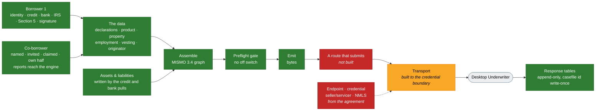

# What DU needs, and what we have

Where the Desktop Underwriter work stands against the readiness audit of
2026-09-08. Re-measured at `f974ba1`. **Update it in the commit that changes
what it says.** A status page that lags the code gets believed.

## The bottom line

**An application becomes a casefile Desktop Underwriter would accept. Nothing
sends it.**

- **Built:** the model, the assembler, a preflight gate with no off switch, the
  emitter, the transport adapter and the response tables. All eleven columns
  that stood between the model and a sendable casefile, plus the twelfth the
  gate found.
- **Not built:** the one route or job that runs that path for a real
  application. Nothing outside the tests calls the assembler, the emitter, the
  `du` port or `recordDuResponse`.
- **Not ours to build:** an endpoint, a credential, Grander's seller/servicer
  number and five NMLS values. Each is a value from the integration agreement.
  The code refuses every placeholder in production.

## Where it stands

🟢 built, enforced, tested · 🟡 built, with a named gap · 🔴 not built, or
blocked outside the code

| #   | Item                                |     | Today                                                                                |
| --- | ----------------------------------- | --- | ------------------------------------------------------------------------------------ |
| 1   | One casefile per loan               | 🟢  | Ours is stable; DU's is write-once, written only by `recordDuResponse`               |
| 2   | Income survives a re-pull           | 🟢  | Snapshot lineage on every row; nothing deletes and recreates                         |
| 3   | Borrower declarations               | 🟢  | Asked on screen 3, stored per person, chains held by CHECKs                          |
| —   | Current residence                   | 🟢  | The fabricated `"rent"` is gone; screen 3 asks                                       |
| 4   | Verification report identifier      | 🟡  | Every row names its snapshot; the asset arc to a verification is disputed in the tab |
| 5   | Up to four borrowers                | 🟢  | Named, invited, claimed, own half walked; the engine reads everybody's reports       |
| 6   | Assets, liabilities, owned property | 🟢  | Tables, ownership, writers; the credit and bank pulls write them per person          |
| 7   | Employer as an entity               | 🟡  | Every pulled job has one; two current employers leave wage income unattached         |
| 8   | What we compute vs. what DU does    | 🟢  | Boundary written, both columns typed and CHECKed, a corpus test holds it             |
| —   | Identity model                      | 🟢  | Party is the person; facts carry provenance                                          |
| —   | Ownership shape                     | 🟢  | Join tables with roles; nothing emittable without an owner                           |
| —   | Product and property                | 🟢  | A product table, two building facts retrieved, one estate question asked             |
| —   | Vesting and non-borrower parties    | 🟢  | Asked on review; originator rows at birth; ten-party ceiling enforced                |
| —   | Generators and `du:verify`          | 🟢  | Six tables from the corpus, rebuilt and checked in CI                                |
| —   | Assembler and emitter               | 🟢  | MISMO 3.4 with arcs, round-tripped on all eighteen samples                           |
| —   | Preflight gate                      | 🟢  | Graph, cardinality, conditionality, format; every check has a fixture                |
| —   | Transport                           | 🟡  | Built to the credential boundary; tested against a stubbed `fetch`                   |
| —   | Response recording                  | 🟢  | Append-only tables, unknown verdicts refused; no caller yet                          |
| —   | A route that submits                | 🔴  | Nothing outside the tests runs assemble, gate, emit, send                            |
| —   | Who we submit under                 | 🔴  | Institution and originator are placeholders, refused in production                   |

Fifteen green, three yellow, two red. Re-derive the tally from the table, not
the other way around.

## What's left, in dependency order

1. **A route or job that submits.** Assemble, gate, emit, `du.submit`,
   `recordDuResponse`. Every piece exists and is tested alone. Nothing strings
   them together for an application.
2. **The values from the agreement.** `DU_ENDPOINT`, `DU_CREDENTIAL_SCHEME`,
   `DU_CREDENTIAL`, `DU_SELLER_SERVICER_NUMBER`, and the five
   `ORIGINATION_COMPANY_*` / `LOAN_ORIGINATOR_*` values. Longest lead time of
   anything here, and no code closes it.

Item 1 waits on nothing. Item 2 is a contract.

## Decided

- **We assemble and submit ourselves.** Not a handoff to Grander's intake.
  Decided 2026-09-11. This is why the schema chain is ours to satisfy and the
  casefile has to round-trip.
- **Under Grander's seller/servicer number.** Grander is the creditor;
  Supermortgage administers as their agent. Decided 2026-09-14.
- **The corpus is vendored, all of it.** Nine XSDs (five MISMO, three Fannie,
  `xml.xsd`), eighteen samples and the specification workbook live in
  `packages/du-schema`. The workbook was held out as "a document that moves";
  that cost four of the six generated tables any automated check. Reversed
  2026-09-14. `du:verify` rebuilds all six from it in CI.
- **Vendored under a decision, not a signed license.** Build as though the
  MISMO EULA and the DU integration agreement are in place. No real borrower
  and no real loan goes through until they are. Whose each file is, is in
  `packages/du-schema/README.md`; a test fails if a re-vendor brings in one
  nobody assigned.
- **V1 scope is narrower than the model.** Conventional Fannie purchase and
  rate-and-term refinance, up to four borrowers including co-signers. Out:
  cash-out, HELOCs, seconds, VA, FHA, USDA. Two are enforced:
  `loan_files_v1_scope` refuses `CASH_OUT_REFINANCE`, and there is no
  `GUARANTOR` role, because DU has none; a co-signer is a
  `NON_OCCUPANT_CO_BORROWER`.

## Not ours to close

**Every submission carries the institution and the originator, and both are
placeholders that say so.** An empty element is a casefile Fannie rejects. A
plausible number is one it accepts against somebody else's institution.

| Element                                   | Placeholder       | Source when real                                          |
| ----------------------------------------- | ----------------- | --------------------------------------------------------- |
| `LOAN_IDENTIFIER`, type `LenderLoan`      | `PLACEHOLDER-DEV` | Nothing mints one and no column holds one                 |
| `SubmittingParty`, `PartyRoleIdentifier`  | `PLCHLD`          | `DU_SELLER_SERVICER_NUMBER`                               |
| `LoanOriginationCompany` name and NMLS id | letters in the id | `ORIGINATION_COMPANY_NAME`, `ORIGINATION_COMPANY_NMLS_ID` |
| `LoanOriginator` name and NMLS id         | letters in the id | `LOAN_ORIGINATOR_FIRST_NAME`, `_LAST_NAME`, `_NMLS_ID`    |

`assertInstitutionEmittable` and `assertOriginatorEmittable` throw on any of
them when `NODE_ENV` is `production`. The API refuses to boot with
`DU_PROVIDER=fannie` and any of the four `DU_*` values unset. `/api/health`
reports `originator: placeholder` until the five are set.

Two smaller open questions of the same kind. Somebody with authority still has
to read the MISMO EULA. And the conditionality table is keyed by 85 of
Fannie's condition statements verbatim; if no spec text belongs in the tree,
swapping the keys for indices is a small change.

## The audit, item by item

**Item 1: one casefile per loan.** `applications.aus_casefile_id` is minted
once at birth, NOT NULL, UNIQUE. `du_casefile_id` is DU's own, write-once by
trigger: a rewrite of the same value is a no-op, a different value raises.
`recordDuResponse` is the only writer, and a second trigger refuses a response
filed under any other casefile. Nothing calls it outside the tests, because
nothing submits.

**Item 2: income survives a re-pull.** Rows carry `first_seen_snapshot_id`,
`last_seen_snapshot_id` and `retired_by_snapshot_id`. The same change fixed a
delete with no party filter that would have let a co-borrower's pull erase the
applicant's income.

**Item 3: declarations.** Three tables, chains as CHECKs, an AI principal
refused, a borrower refused from answering for anybody else, a bankruptcy with
no chapter refused at COMMIT. They used to be derived from four reports and
signed as "here is what we found"; `buildDeclarations` is deleted and a test
keeps it gone. The written explanation of a bankruptcy is persisted.

**Item 4: the verification report identifier.** `connector_snapshots` carries
the vendor's report id and, now, `party_id`: required for person-keyed kinds,
forbidden for address-keyed ones. Income, employment and the
`UNDERWRITING_VERIFICATION` elements read it, one per report type per borrower,
latest pull only. Every asset and liability row names the snapshot it came from.
What is not emitted is the arc from a verification to an asset: the tab disputes
its endpoint and the emitter throws on a disputed name, so it waits on Fannie
Mae rather than on code.

**Item 5: up to four borrowers.** The ceiling is held twice: `borrower_ordinal`
is constrained one through four at the database, and the preflight caps
`BORROWER` at four (two on VA). The second person arrives in two steps that are
two people's:

- **Naming.** `POST /files/:id/co-borrowers` takes a name, an email and whether
  they will live in the home. It creates a PROVISIONAL party under the
  applicant's principal, a borrower row with no number, and a membership at the
  smallest free position. An identity posted there is refused, not stripped.
- **Claiming.** The invitation emails a link whose token exists only in the
  email, in the URL fragment; the table holds its SHA-256, seven days, one live
  per person. `POST /auth/claims/preview` shows a stranger what the email said.
  `POST /auth/claims/accept`, signed in with Google, merges the named party into
  the person's own. The trigger allows PROVISIONAL to go to CLAIM_PENDING or
  MERGED and nowhere else.
- **Their own half.** Screen 2, Section 5, their own bank link, demographics and
  one signature, in their own session. Every route resolves "the borrower" by
  the person asking. A member's read is redacted in both directions: the
  applicant sees that a co-borrower answered and signed, never what they said.
- **The file waits.** Signing, deciding and assembling refuse while a named
  person has not stated their own number, with a 409 `CO_BORROWER_PENDING`.
  The TRID clock does not wait: it opens on one applicant's pieces and may only
  err early.
- **Nobody signs for anybody.** Each borrower signs their own 4506-C. `tokenFor`
  takes the file and the person and checks that person's consent on this file,
  so a signature on another application licenses nothing here. The sample
  household is seeded through this path: Priya names Dev, the seed reads his
  link from the fixture outbox, and he claims it as a sign-in of his own.

- **The engine reads everybody.** `LoanFile.reports` carries each person's
  reports by party. The loan's score is the lowest of the borrowers' own and
  the minimum is tested against their average; a joint account counts once;
  a missing credit report blocks the score and the debts by name; reserves
  count every connected bank; a non-occupant co-borrower caps the LTV at 95.
  Every read of the file is redacted to the reader's own reports.
  `docs/decisions.md`, "A household's numbers are the household's".

What remains is the paper path: a household stated through
`appendCoBorrowerWithFacts`, which only the tests use, still answers
`marital_status` and `preferred_language` for a person nobody asked.

**Item 6: assets, liabilities, owned property.** `OWNED_PROPERTY` nests inside
an asset through a composite FK on a generated `asset_kind`. A liability carries
a nullable FK to the owned-property row securing it. Per-kind CHECKs constrain
the type, not only the nulls. `lien_upb_cents` is derived by trigger. Ownership
is join tables with roles; deferred triggers refuse anything emittable with no
owner and survive a revive, a role flip and an account deletion. An account
keeps its row across a re-pull through a three-tier identity key prefixed by
the party. The credit pull writes each tradeline as a liability the person
owes, and the bank pull writes each qualifying account and each gift as an
asset they own, matched in place on a re-pull and retired when a report drops
them (`docs/decisions.md`, "The pulls write the rows a casefile carries").
Which owned property secures a mortgage is still a person's pairing.

**Item 7: employer as an entity.** Real, with a party FK and an identity key
that survives the EIN promotion. `income_sources.employment_income` is true
exactly when the row names an employer, held by a CHECK, so the arc is derived
rather than stored twice. Every job comes from a pull, and every pull creates
or joins an employer. The gap: `employerForIncome` attaches wage income only
when exactly one employer is active, so a borrower with two current jobs emits
`EmploymentIncomeIndicator` false on both. `DI-C04` is that shape.

**Item 8: what we compute versus what DU computes.** Three tiers, held by
`packages/du/src/__tests__/boundary.test.ts`:

- **DU derives, we shadow.** The eight `Ratios` and four `ReserveAssessment`
  figures, the representative score, seasoning and the recommendation.
  `DU_DERIVED_FIGURES` names the Map data points each comes from. The test
  fails the day a workbook upgrade lists one of those elements.
- **We assert, DU consumes.** Loan amount, rate, value, every liability, asset
  and income item. Four lender-computed inputs are not yet emitted, listed in
  `packages/du-schema/du-not-round-tripped.txt`.
- **Ours alone.** Compliance, pricing, the outcome, adverse-action reasons and
  the derivations.

`decisions.ratios` and `decisions.reserves` are parsed through
`@hm/shared/decision-figures` on write and read, and two CHECKs hold the same
shape in Postgres, added `NOT VALID` so an old row cannot abort a deploy. A
recommendation is recorded and is not a decision: nothing in `du_responses`
moves an application.

**The product and the property.** Eleven columns stood between the model and a
sendable casefile, all built, in three places:

- `loan_products` holds `MortgageType`, `AmortizationType` and the five
  indicators. A loan builds or balloons because of what it is, not who is
  quoted. `loan_files.product_code` is a FK, RESTRICT both ways, and a trigger
  refuses rewriting a product in place: a product on different terms is another
  row.
- `financed_unit_count` and `property_attachment_type` are retrieved off the
  assessor record on screen 1. `AttachmentType` is the twelfth column, found by
  the gate the moment a unit count existed to require it. All eighteen samples
  carry it, seven `Attached` and eleven `Detached`.
- `property_estate_type` is asked on screen 3 as APP-028, because no vendor
  record carries it and the title commitment does not exist at submission.
- The three on a job: `EmploymentClassificationType` is derived (the current job
  with the most employment income is Primary), and the two URLA 1b answers are
  asked on the review screen as APP-029, stored with who said them and when.

All are nullable and nothing defaults one. A moved address nulls the three
building facts by trigger. The gate test in `du-submission.test.ts` asserts an
empty finding list and emits; three tests beside it withhold one thing each and
name what goes missing.

**Vesting and the non-borrower parties.** `du_vestings` holds the sentence that
will read on title, asked on the review screen and refused at signing when
absent. `du_deal_parties` holds the origination company and the originator,
written at application birth by `recordOriginationParties`. A deferred trigger
counts the ten-party ceiling across both tables and the borrowing parties, and
the preflight counts `PARTY` against the same ten at emission. `NotePayTo` and
`HousingCounselingAgency` have no writer; DU's minimum is one non-borrower
party, and the originator is it. `NotePayTo` is bound to the entity shape, so a
seller carryback cannot be recorded until an individual column exists.

**The submission path.** `packages/du` assembles an application into a MISMO
3.4 `MESSAGE`, `RELATIONSHIP` arcs included, ordered by the generated child
sequence. `emitSubmission` returns bytes or throws; there is no argument that
turns the preflight off. The gate checks what the schema cannot see: dangling
arcs, duplicated labels, invented arcroles, an asset nobody owns, cardinality
minima scoped by role, forty-three of the forty-five data points the
specification requires unconditionally (the other two appear in no shipped
casefile), eighty-eight conditional rules, every value's format and width, and
the rows the identity matcher refused to tell apart. All eighteen samples pass;
every check has a fixture built by mutating one, and `xmllint` accepts all but
two of those fixtures. A finding names an XPath, a label or a row id, never a
value, so it is safe in a log.

The `du` port refuses unless every borrower the manifest declares has
authorized every category it declares about them, on a signature made on this
application. It reads the manifest, not the bytes: a person the emitter puts in
and the manifest leaves out is transmitted with nobody's permission checked.

The transport posts to `DU_ENDPOINT` under one of three header credential
schemes, reads the answer through a reader that refuses any shape it cannot
vouch for, and resends DU's own casefile id on a resubmission so one loan does
not open two cases. It is exercised against an injected `fetchImpl`, never a
server. `du_responses` and `du_response_messages` are append-only by trigger
and refuse a status this system has never seen. No route calls any of it.

## Facts worth keeping

- **The ArcRoles tab holds eleven arcs**, not 82 and not 23. It describes each
  arc twice across 82 rows. Nine of the eleven appear in the shipped samples;
  the two that do not are `UNDERWRITING_VERIFICATION_IsAssociatedWith_ASSET`
  and `_EMPLOYER`. `generated/arcroles.ts` carries the count and `du:verify`
  re-derives it.
- **The tab disagrees with itself at two ends.** The `ASSET` arc targets
  `OWNED_PROPERTY_DETAIL` by XPath and `ASSET` by name; the `EMPLOYER` arc
  targets `EMPLOYER` by XPath and `EMPLOYMENT` by column. The table carries
  both names and a `disputed` flag, the emitter throws on a disputed name, and
  the tie is Fannie Mae's to break.
- **The Cardinality tab holds 171 distinct container XPaths**, not 174.
- **Schema validity is a lint, not a gate.** A dangling `xlink:to`, a duplicate
  label, an invented arcrole, duplicate sequence numbers, five borrowers, and a
  deleted `RELATIONSHIPS` container all validate. `packages/du-schema` asserts
  each of them passes, so nobody promotes `xmllint` to a gate later.
- **`DI-C09` is the sample to read first.** One asset owned by two borrowers,
  one liability with two obligors, an asset linked to the liability it secures,
  income items linked to employers. A DU submission is a graph of arcs, not a
  nested document; `docs/du-graph.md` is the model.

## How to check this

Every claim about our code names a file, a table, a function or a test at the
commit above. Every claim about DU names a tab or a sample in
`packages/du-schema`. Open five at random and confirm they say what this says
they say.
